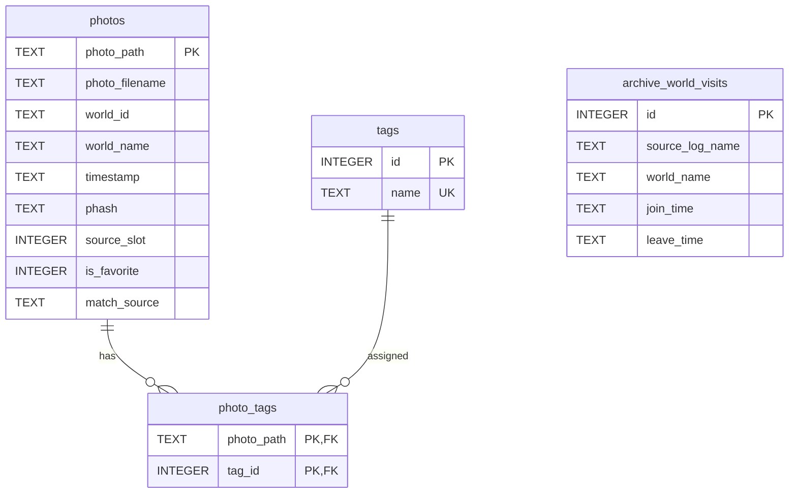

# Database Schema

この文書は、`app/Core/Database/AlpheratzDb.cs` が初期化する現行 SQLite schema と、その列を実際に使うクエリの契約を記録する。

## Storage

- DB file: `<install>\Data\db\Alpheratz.db`
- Settings file: `<install>\Data\db\setting.json`。SQLite の一部ではない。
- DB paths: `photo_path` は Windows の `\` を `/` へ置き換えて保存する。
- Date/time: SQLite の date type は使わず、比較可能な ISO 形式の `TEXT` として保存する。
- Boolean: `INTEGER` の `0 / 1` を使う。

テストは constructor へ別の DB path を渡し、利用者のデータ領域へ書き込まない。

## Relationships



`archive_world_visits` は写真と外部キーで結ばない。撮影時刻を訪問区間へ照合して `photos.world_name` を補完するための再構築可能な作業データである。

## Tables

### `photos`

| Column | SQLite type | Null | Default | Meaning |
| --- | --- | --- | --- | --- |
| `photo_path` | `TEXT` | No | — | 正規化済み絶対パス。primary key |
| `photo_filename` | `TEXT` | No | — | 表示用ファイル名 |
| `world_id` | `TEXT` | Yes | `NULL` | VRChat の `wrld_...` ID |
| `world_name` | `TEXT` | Yes | `NULL` | ワールド名 |
| `timestamp` | `TEXT` | No | — | 撮影日時。並べ替えと archive 照合に使用 |
| `last_modified_utc` | `TEXT` | Yes | `NULL` | 内容変更検出用の更新時刻 |
| `phash` | `TEXT` | Yes | `NULL` | 64 hex文字×最大4方向を `|` で連結した PDQ |
| `phash_version` | `INTEGER` | Yes | `0` | 互換用列。現行の PDQ 保存処理は値を更新せず、内容変更時に0へ戻す |
| `orientation` | `TEXT` | Yes | `NULL` | `landscape`, `portrait`, `unknown`, `unreadable` |
| `image_width` | `INTEGER` | Yes | `NULL` | pixel width |
| `image_height` | `INTEGER` | Yes | `NULL` | pixel height |
| `source_slot` | `INTEGER` | Yes | `1` | `1` または `2` |
| `is_favorite` | `INTEGER` | Yes | `0` | お気に入り状態 |
| `match_source` | `TEXT` | Yes | `NULL` | ワールド情報の由来 |
| `is_missing` | `INTEGER` | Yes | `0` | 互換用の可視性フラグ。現行 scan は欠落行を物理削除するが、すべての一覧 query は0だけを読む |

`source_slot`、boolean、`match_source` には DB の `CHECK` constraint を置いていない。現行アプリケーションが有効値を渡す。

確認できる `match_source` 値:

| Value | Meaning |
| --- | --- |
| `metadata` | PNG metadata から取得 |
| `title` | 既存のワールド情報を保持した scan |
| `unresolved` | scan 時点でワールドを取得できない |
| `polaris_archive` | Polaris の訪問区間から補完 |
| `phash` | サービス API で類似写真からコピー |
| `phash_confirmed` | World Resolve で候補を利用者が確定 |
| `manual` | World Resolve でワールド名を手入力 |

未知ワールドの query 条件は次の組合せである。

```sql
(world_name IS NULL OR TRIM(world_name) = '')
AND world_id IS NULL
AND is_missing = 0
```

`UpdatePhotoWorldAsync` へ `worldId = null` を渡した場合は、`COALESCE` により既存の `world_id` を保持する。

### `tags`

| Column | SQLite type | Null | Default | Meaning |
| --- | --- | --- | --- | --- |
| `id` | `INTEGER` | No | auto | primary key |
| `name` | `TEXT` | No | — | unique tag name |

DB の `UNIQUE` は既定 collation に従う。現行 UI と ViewModel は前後空白を除去し、大文字小文字を無視した重複を登録前に拒否する。表示時も大文字小文字を無視して重複排除・昇順整列する。

### `photo_tags`

| Column | SQLite type | Null | Meaning |
| --- | --- | --- | --- |
| `photo_path` | `TEXT` | No | `photos.photo_path` への foreign key |
| `tag_id` | `INTEGER` | No | `tags.id` への foreign key |

primary key は `(photo_path, tag_id)`。新規 DB では両方の foreign key に `ON DELETE CASCADE` を付ける。

既存 DB へ CASCADE を追加する table rebuild は行わない。そのため、タグマスタ削除と source slot reset は関連行を明示削除し、reset の最後に orphan も削除する。

### `archive_world_visits`

| Column | SQLite type | Null | Meaning |
| --- | --- | --- | --- |
| `id` | `INTEGER` | No | auto increment primary key |
| `source_log_name` | `TEXT` | No | 元の `output_log_*.txt` |
| `world_name` | `TEXT` | No | `Entering Room` から取得した名前 |
| `join_time` | `TEXT` | No | 入室時刻 |
| `leave_time` | `TEXT` | Yes | 退室時刻。ログ末尾で未退室なら null |

archive を読み込むたびに、全行を1 transaction内で `DELETE` してから200行単位で再挿入する。撮影時刻に対する検索は `join_time <= timestamp` かつ `leave_time IS NULL OR leave_time >= timestamp` を満たす最新の訪問を1件返す。

## Indexes

| Index | Columns | Used for |
| --- | --- | --- |
| `idx_photos_timestamp` | `photos(timestamp)` | 撮影日時の範囲と並べ替え |
| `idx_photos_world_name` | `photos(world_name)` | ワールド検索・集計 |
| `idx_photos_is_favorite` | `photos(is_favorite)` | お気に入り絞り込み |
| `idx_photos_is_missing` | `photos(is_missing)` | 可視行の共通条件 |
| `idx_archive_world_visits_join_time` | `archive_world_visits(join_time)` | 撮影時刻の訪問区間検索 |
| `idx_archive_world_visits_source_log_name` | `archive_world_visits(source_log_name)` | 元ログ単位の参照 |

`photo_tags` は複合 primary key、`tags.name` は unique indexを利用する。

## Connection Configuration

接続を開くたびに次を設定する。

```sql
PRAGMA journal_mode = WAL;
PRAGMA synchronous = NORMAL;
PRAGMA foreign_keys = ON;
PRAGMA busy_timeout = 5000;
```

- WAL は gallery read と background write の共存を可能にする。
- `synchronous=NORMAL` はローカル写真インデックスの write cost を抑える。
- foreign key は接続単位で有効化する。
- `busy_timeout=5000` は短い write overlap を即時エラーにしない。

接続 object は操作ごとに破棄し、`Microsoft.Data.Sqlite` の connection pooling に物理接続の再利用を任せる。

## Query Semantics

写真一覧の共通条件は `photos.is_missing = 0`。値は parameter bind し、可変条件だけ SQL fragment を組み立てる。

- `WorldQuery`: `LIKE '%value%'`
- `WorldExacts`: `TRIM(world_name) = value` の OR。不明値は null・空・空白をまとめる。
- `TagFilters`: tagごとに `EXISTS` を追加するため、指定した全タグを持つ写真だけが一致する。
- Date: start は `>=`、end は指定日を含む end timestamp へ正規化して `<=`。
- Sort `dateDesc`: `timestamp DESC, photo_path ASC`
- Sort `worldAsc`: `world_name COLLATE NOCASE ASC, timestamp DESC, photo_path ASC`

写真ページでは、count、page本体、返却写真のtag一括取得を同じ deferred read transactionで行い、scan writeが途中に入って total と items がずれないようにする。`IncludePhash=false` では `phash` を `NULL` として射影し、通常 gallery へ大きな文字列を転送しない。

## Write Transactions

| Operation | Transaction boundary |
| --- | --- |
| Scan upsert | 最大500写真を1 transaction |
| Missing photo delete | `photo_tags` と `photos` を最大500 pathずつ、全体を1 transaction |
| Add multiple tags | tag master追加と1写真への関連付けを1 transaction |
| Delete tag master | 関連 `photo_tags` と `tags` を1 transaction |
| Bulk favorite / tag | service側で写真ごとの結果を保持し、DB helperは対象単位で更新 |
| PDQ update | 30写真を1 transaction |
| Archive visits | 全置換を1 transaction、insertは200行 chunk |
| Source slot reset | slotの関連行と写真行を1 transaction。cache削除はcommit後 |

source slot reset で cache の削除だけが失敗した場合、DB reset は取り消さない。cache は再生成可能であり、次の gallery load と scan を妨げないためである。

## Initialization and Compatibility

`Initialize()` は idempotent に table と index を作成する。`photos` の次の列がない既存 DB には `ALTER TABLE ... ADD COLUMN` を実行する。

- `orientation`
- `image_width`
- `image_height`
- `source_slot`
- `is_favorite`
- `match_source`
- `is_missing`
- `phash_version`
- `last_modified_utc`

現行 schema で使わない `photo_embeddings` table が存在すれば削除する。schema version table や `PRAGMA user_version` は使わない。

この互換処理は現行コードに存在する動作の記録であり、新しい migration framework を導入する契約ではない。

## Backup and Restore

整合した手動 backup を作る場合はアプリを終了し、`Data\db` をディレクトリ単位でコピーする。WAL mode のため、実行中に `Alpheratz.db` 本体だけをコピーしない。

完全な利用状態には次も必要である。

- `setting.json`: folder、theme、view、startup、post、template
- `Data\cache`: 再生成可能。backup必須ではない。
- 写真原本: Alpheratz の管理外。DB backupには含まれない。

restore 後に写真原本の path が変わっている場合、DB path と一致しないため再scanが必要になる。
