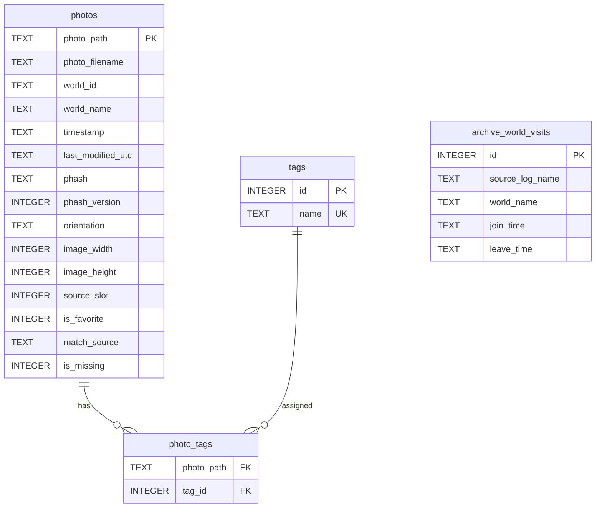

# Database Schema

> Alpheratz のメインデータベース (`Data/db/Alpheratz.db`) のスキーマリファレンス。
> スキーマ定義の一次情報は `app/Core/Database/AlpheratzDb.cs`。

## Table of Contents

- [Overview](#overview)
- [Conventions](#conventions)
- [ER Diagram](#er-diagram)
- [Tables](#tables)
  - [photos](#photos)
  - [tags](#tags)
  - [photo_tags](#photo_tags)
  - [archive_world_visits](#archive_world_visits)
- [Indexes](#indexes)
- [Initialization and PRAGMA](#initialization-and-pragma)
- [Migrations](#migrations)
- [Backup and Restore](#backup-and-restore)
- [Performance Notes](#performance-notes)

---

## Overview

| Property | Value |
| --- | --- |
| Engine | SQLite 3 via `Microsoft.Data.Sqlite` |
| Journal Mode | WAL |
| Foreign Keys | Enforced (`PRAGMA foreign_keys = ON`) |
| Tables | 4 |
| Views | 0 |
| Indexes | 6 (UNIQUE 制約による自動生成を除く) |
| Schema Definition | `app/Core/Database/AlpheratzDb.cs` |

データベースは写真メタデータ、タグ、写真タグ関連、Polaris archive 由来のワールド訪問履歴で構成される。

---

## Conventions

### Naming

| Element | Convention | Example |
| --- | --- | --- |
| Table name | snake_case | `archive_world_visits` |
| Column name | snake_case | `photo_path` |
| Primary key | 自然キーまたは `id INTEGER PRIMARY KEY AUTOINCREMENT` | `photos.photo_path`, `tags.id` |
| Timestamp | `TEXT` 型、`YYYY-MM-DD HH:MM:SS` 形式 | `timestamp`, `join_time` |
| Boolean | `INTEGER` 0/1 | `is_favorite`, `is_missing` |

### Type Mapping

| Declared Type | C# Type | Usage |
| --- | --- | --- |
| `TEXT` | `string` / `string?` | パス、ファイル名、時刻、ワールド名 |
| `INTEGER` | `long` / `long?` / `bool` | ID、画像サイズ、フラグ |

### Idempotency

| Table | Idempotency Mechanism |
| --- | --- |
| `photos` | `photo_path PRIMARY KEY` に対する upsert |
| `tags` | `name UNIQUE` |
| `photo_tags` | `PRIMARY KEY(photo_path, tag_id)` |
| `archive_world_visits` | ログ再読込時に対象データを投入し直す |

---

## ER Diagram



---

## Tables

### photos

写真 1 ファイルを 1 行で表す主テーブル。

| Column | Type | Nullable | Default | Description |
| --- | --- | --- | --- | --- |
| `photo_path` | TEXT | NO | - | 正規化済みファイルパス。主キー |
| `photo_filename` | TEXT | NO | - | ファイル名 |
| `world_id` | TEXT | YES | NULL | 画像メタデータから取得したワールド ID |
| `world_name` | TEXT | YES | NULL | ワールド表示名 |
| `timestamp` | TEXT | NO | - | 撮影時刻 |
| `last_modified_utc` | TEXT | YES | NULL | ファイル更新時刻 |
| `phash` | TEXT | YES | NULL | PDQ ハッシュの hex 文字列 |
| `phash_version` | INTEGER | YES | `0` | PDQ ハッシュ生成バージョン |
| `orientation` | TEXT | YES | NULL | 画像向き |
| `image_width` | INTEGER | YES | NULL | 画像幅 |
| `image_height` | INTEGER | YES | NULL | 画像高さ |
| `source_slot` | INTEGER | YES | `1` | 1st / 2nd 写真フォルダの識別 |
| `is_favorite` | INTEGER | YES | `0` | お気に入りフラグ |
| `match_source` | TEXT | YES | NULL | ワールド名解決元 |
| `is_missing` | INTEGER | YES | `0` | 再スキャン時にファイルが見つからない状態 |

**Constraints**

- `PRIMARY KEY (photo_path)`

### tags

タグマスタ。

| Column | Type | Nullable | Default | Description |
| --- | --- | --- | --- | --- |
| `id` | INTEGER | NO | AUTOINCREMENT | 主キー |
| `name` | TEXT | NO | - | タグ名 |

**Constraints**

- `PRIMARY KEY (id)`
- `UNIQUE (name)`

### photo_tags

写真とタグの多対多テーブル。

| Column | Type | Nullable | Default | Description |
| --- | --- | --- | --- | --- |
| `photo_path` | TEXT | YES | NULL | `photos.photo_path` を参照 |
| `tag_id` | INTEGER | YES | NULL | `tags.id` を参照 |

**Constraints**

- `PRIMARY KEY (photo_path, tag_id)`
- 新規 DB では `photos` / `tags` への `ON DELETE CASCADE` を付与する。

**Notes**

- 既存 DB の `photo_tags` は SQLite の制約上、外部キーへ CASCADE を後付けしない。キャッシュリセット時に孤児行削除を併用する。

### archive_world_visits

Polaris archive の VRChat ログから読み取ったワールド訪問履歴。

| Column | Type | Nullable | Default | Description |
| --- | --- | --- | --- | --- |
| `id` | INTEGER | NO | AUTOINCREMENT | 主キー |
| `source_log_name` | TEXT | NO | - | 元ログファイル名 |
| `world_name` | TEXT | NO | - | 入室したワールド名 |
| `join_time` | TEXT | NO | - | 入室時刻 |
| `leave_time` | TEXT | YES | NULL | 退室時刻。確定できない場合は NULL |

---

## Indexes

| Index | Table | Columns | Purpose |
| --- | --- | --- | --- |
| `idx_photos_timestamp` | `photos` | `timestamp` | 日付フィルタ、月別表示 |
| `idx_photos_world_name` | `photos` | `world_name` | ワールド検索 |
| `idx_photos_is_favorite` | `photos` | `is_favorite` | お気に入り抽出 |
| `idx_photos_is_missing` | `photos` | `is_missing` | 欠損ファイル抽出 |
| `idx_archive_world_visits_join_time` | `archive_world_visits` | `join_time` | 撮影時刻からの訪問履歴照合 |
| `idx_archive_world_visits_source_log_name` | `archive_world_visits` | `source_log_name` | ログ単位の参照 |

---

## Initialization and PRAGMA

`AlpheratzDb.Initialize` が起動時に `EnsureSchema` を呼び出す。接続作成時は毎回以下の PRAGMA を設定する。

### Active PRAGMAs

| PRAGMA | Value | Reason |
| --- | --- | --- |
| `journal_mode` | `WAL` | スキャン書き込み中の UI 読み取りを阻害しにくくする |
| `synchronous` | `NORMAL` | WAL と組み合わせて書き込み性能を確保する |
| `foreign_keys` | `ON` | 新規 DB の `photo_tags` CASCADE を有効化する |

---

## Migrations

`EnsureSchema` は `CREATE TABLE IF NOT EXISTS` / `CREATE INDEX IF NOT EXISTS` と列存在確認による `ALTER TABLE ADD COLUMN` で構成される。

| Operation | Purpose |
| --- | --- |
| `CREATE TABLE IF NOT EXISTS` | 現行テーブル群を作成 |
| `CREATE INDEX IF NOT EXISTS` | 検索用インデックスを作成 |
| `AddColumnIfMissing` | 既存 DB に不足列を追加 |
| `DROP TABLE IF EXISTS photo_embeddings` | 現行で使わない旧テーブルを削除 |

追加列として扱う列は `orientation`, `image_width`, `image_height`, `source_slot`, `is_favorite`, `match_source`, `is_missing`, `phash_version`, `last_modified_utc`。

---

## Backup and Restore

### Backup

アプリ終了後、以下をコピーする。

```
<install>\Data\db\Alpheratz.db
<install>\Data\db\setting.json
```

サムネイルキャッシュは再生成可能なため必須ではない。

### Restore

アプリ終了後、同じパスへバックアップファイルを戻す。DB と設定の不整合を避けるため、復元後にアプリを起動して再スキャンする。

### External Tools

SQLite Browser 等で DB を開く場合は、アプリ終了中に読み取り専用で確認する。

---

## Performance Notes

### Write Performance

- WAL + `synchronous=NORMAL` を採用する。
- タグや archive visits の複数行投入はトランザクション化する。

### Read Performance

- 日付、ワールド、お気に入り、欠損、訪問履歴照合にインデックスを張る。
- 一覧表示で PDQ ハッシュが不要な場合は `phash` を射影しない。

### Storage

- DB は写真本体を保持しない。
- サムネイルは `Data/cache` 配下に保存し、削除されても再生成できる。
